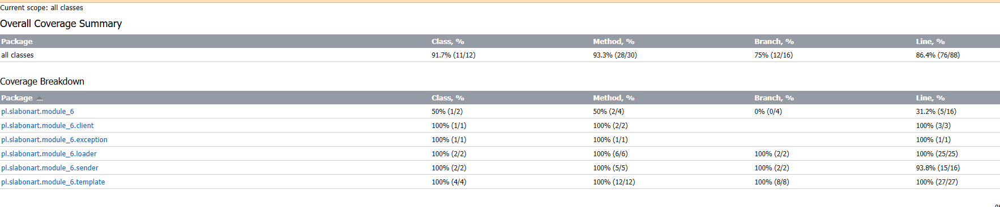
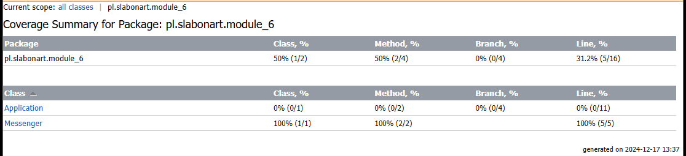
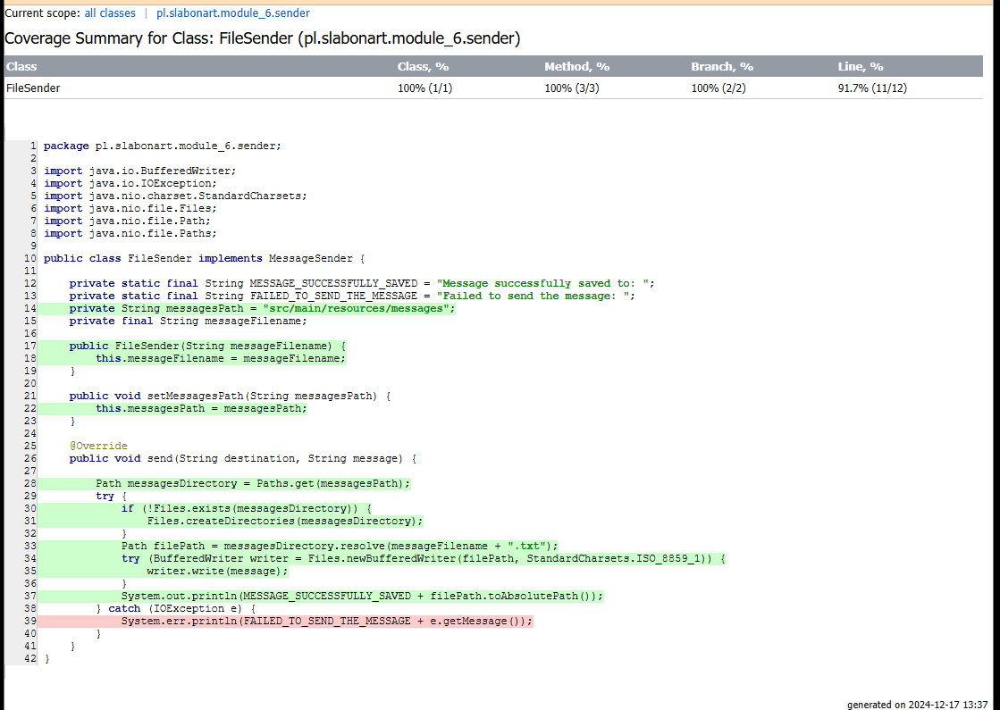

# REQUIREMENTS
## commit 1
REQUIREMENT: The system replaces variable placeholders like #{subject} from a template with values provided at runtime.
## commit 2
REQUIREMENT: If at least for one placeholder value is not provided at runtime – template generator should throw an exception.
## commit 3
REQUIREMENT: Template generator ignores values for variables provided at runtime that aren’t found from the template.
## commit 4
REQUIREMENT: System should support values passed in runtime with #{…}. E.g. template is  “Some text: #{value}” and  at runtime #{value} passed as  #{tag}. Output should be “Some text: #{tag}”.
## commit 5
REQUIREMENT: TThe system supports the full Latin-1 character set in templates and in variables.

# TASK (commit 6)

### 1. TDD approach – (40 points)
Each requirement in the new commit.
### 2. @Parameterized runner  and Dynamic tests (6 points)
see FileSenderTest
### 3. Implement meta annotations and filtering (6 points)
Custom Meta-Annotations @OnDemandTest created
Running tests with '-Dgroups=onDemand' starts only MailServerTest
### 4. TemporaryFolder rule (6 points)
see FileSenderTest and FileValuesLoaderTest
### 5. Mock reading from file/console (6 points)
see TemplateEngineTest - mocked ValuesLoader
### 6. Use partial mock (6 points)
see TemplateTest - only message getter is mocked, setter works like expected
### 7. Use spy (6 points)
see MessengerTest - spy MessageSender to check if message was / was not send
### 8. Create custom extension (jUnit5) to output test execution information to file (6 points)
see TestExecutionLoggerExtension applied to TemplateEngineTest
### 9. Using ExpectedException rule to check exceptions + Assertion mechanism (6 points)
see TemplateEngineTest - testing exceptions
### 10. Implement Disabling test on condition (2 points)
see MailServerTest - running example tests based on OS
### 11. Test quality and adequate coverage will be assessed as (10 points)

